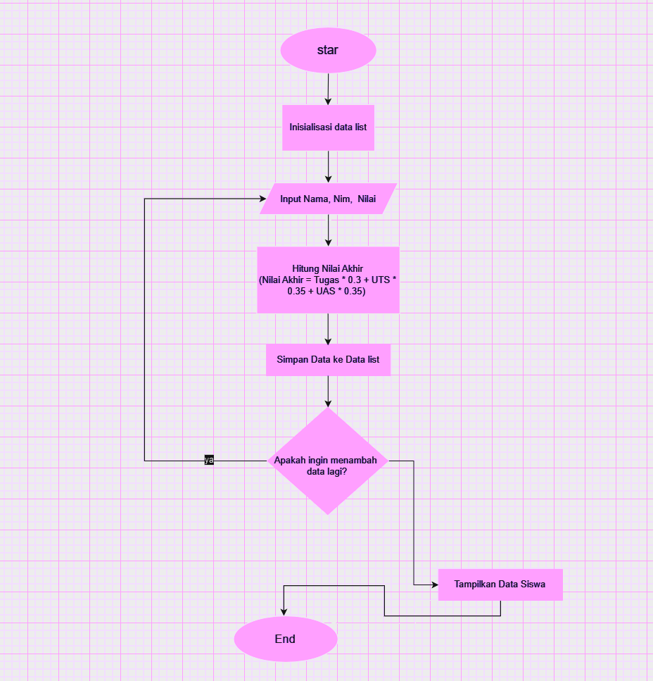

## Program Penghitung Nilai Akhir Mahasiswa
Program ini untuk menghitung nilai akhir mahasiswa berdasarkan bobot nilai tugas, UTS, dan UAS yang telah ditentukan. Program ini juga menampilkan data mahasiswa dalam bentuk tabel.

## Deskripsi Program
Program ini dibuat menggunakan bahasa python dengan fitur:
-List dan Dictionary untuk penyimpanan data.
-Fungsi Kustom (def) untuk perhitungan nilai akhir.
-input() dan int() untuk input dan konversi data.
-while dan if untuk kontrol alur.
-append() dan break untuk menambah data ke list dan menghentikan perulangan.
-print() dan F-string untuk mencetak hasil dalam bentuk tabel yang terformat.

## Flowchart Program


## Kode Program
``` python
# Fungsi untuk menghitung nilai akhir
def hitung_nilai_akhir(tugas, uts, uas):
    return (tugas * 0.3) + (uts * 0.35) + (uas * 0.35)

# List untuk menyimpan data mahasiswa
data_mahasiswa = []

while True:
    # Input data mahasiswa
    nama = input("Nama: ")
    nim = input("NIM: ")
    nilai_tugas = int(input("Nilai Tugas: "))
    nilai_uts = int(input("Nilai UTS: "))
    nilai_uas = int(input("Nilai UAS: "))

    # Hitung nilai akhir
    nilai_akhir = hitung_nilai_akhir(nilai_tugas, nilai_uts, nilai_uas)

    # Tambahkan data mahasiswa ke dalam list
    data_mahasiswa.append({
        "nama": nama,
        "nim": nim,
        "tugas": nilai_tugas,
        "uts": nilai_uts,
        "uas": nilai_uas,
        "akhir": nilai_akhir
    })   

    # Tanyakan apakah ingin menambah data lagi
    tambah_data = input("Tambah data(y/t)? ")
    if tambah_data.lower() != 'y':
        break
    
# Cetak tabel data mahasiswa
print("\n| No | Nama     | NIM  | Tugas | UTS | UAS | Akhir |")
print("|----|----------|------|-------|-----|-----|-------|")
print("~" * 5)
for i, mhs in enumerate(data_mahasiswa, start=1):
    print(f"| {i:2} | {mhs['nama']:<8} | {mhs['nim']:<4} | {mhs['tugas']:<5} | {mhs['uts']:<3} | {mhs['uas']:<3} | {mhs['akhir']:.2f} |")
```

## Output Program
````
| No | Nama     | NIM   | Tugas | UTS | UAS | Akhir |
--------------------------------------------------
| 1  | Dwi      | 312410056 | 100   | 95  | 98  | 97.55 |
| 2  | Fitri    | 312410085 | 90    | 98  | 99  | 95.95 |
| 3  | Friska   | 312410160 | 90    | 98  | 100 | 96.3  |
| 4  | Vivit    | 312410110 | 98    | 95  | 90  | 94.15 |
````

## Cara Kerja Program
# Cara kerja
1. Program pertama kali menginisialisasi list kosong bernama data_mahasiswa untuk menyimpan data setiap mahasiswa.
2. Fungsi hitung_nilai_akhir digunakan untuk menghitung nilai akhir berdasarkan formula:
   \[
   \text{nilai akhir} = (\text{nilai tugas} \times 0.3) + (\text{nilai UTS} \times 0.35) + (\text{nilai UAS} \times 0.35)
   \]
3. Program meminta pengguna untuk memasukkan data nama, NIM, nilai tugas, UTS, dan UAS.
4. Setelah nilai akhir dihitung menggunakan fungsi hitung_nilai_akhir, semua data tersebut disimpan dalam dictionary dan ditambahkan ke dalam list data_mahasiswa.
5. Pengguna dapat memilih untuk menambahkan data mahasiswa lain atau mengakhiri proses input.
6. Setelah input selesai, program akan mencetak data mahasiswa dalam bentuk tabel dengan kolom nomor, nama, NIM, nilai tugas, UTS, UAS, dan nilai
